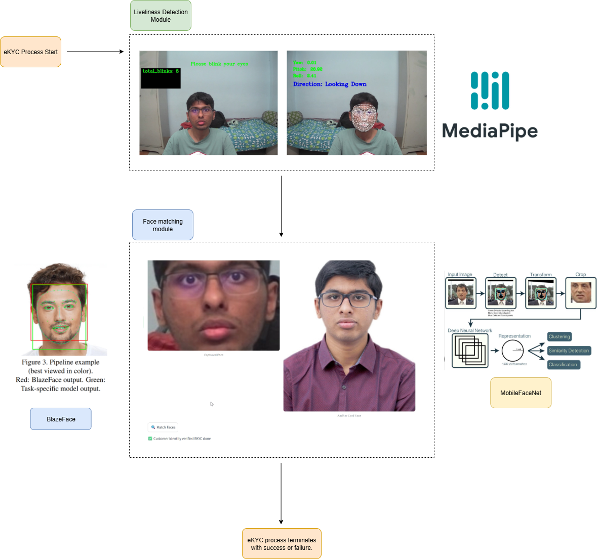

# 🏦🤖MediaPipe-BlazeFace-MobileFaceNet-Rebuilding-Bank-Customer-eKYC-Systems
This repo presents my approach at building a customer eKYC system used by banks etc. from scratch. These Systems have 2 components - Liveliness Detection (Blinking &amp; Head Rotations - Used MediaPipe Keypoints) &amp; Face Matching (Current face capture with face image on an official document like Aadhar etc. - Used BlazeFace + MobileFaceNet). 

# Demo 👇
<video src="demo.mp4" controls width="640"></video>
[[Link to Demo]](https://youtu.be/Z6WPcFX8OxI "Click to watch")

# Overview of the pipeline

## 🚀 Features

✅ **Mediapipe**: A library using which we can estimate **478 3D facial keypoints** in real time. These keypoints can be used to perform simple geometric calculations like **Euclidean Distance, Pitch, Yaw & Roll** which are robust yet **lightweight** measures for **detecting blinks & head turns** used in the **liveliness detection** module .

✅ **BlazeFace**: A **mobile-native, lightweight face detector** that is used to **capture** the customers face when he initiates the eKYC process, after **passing** the liveliness detection phase.

✅ **MobileFaceNet**: A **mobile-native, lightweight face embedderr** that extracts facial features and represents them as an **embedding vector of 128-dimensions**. Embeddings are generated for the customer's **captured face** and their **face image in the submitted official document (aadhar, passport etc.)**. To verify identity, **euclidean distance based similarity score** is computed between the 2 embeddings if the distance is **under 0.45** then identity is verified else eKYC has failed. 
